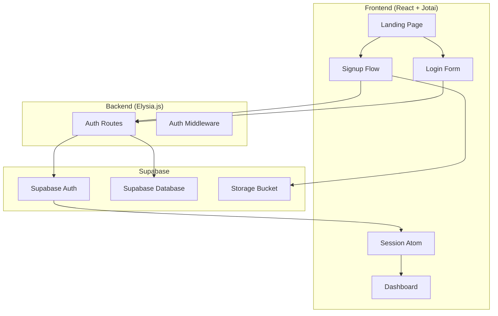

# Design Document: User Authentication

## Overview

This design implements a complete user authentication system with a multi-step signup flow. The backend uses Elysia.js with Supabase Auth for authentication operations. The frontend implements a step-by-step signup wizard using React with Jotai for session state management.

## Architecture



## Components and Interfaces

### Backend Components

#### 1. Auth Routes (`backend/src/auth.ts`)

```typescript
// POST /auth/signup
interface SignupRequest {
  email: string;
  password: string;
  fullName: string;
}

interface SignupResponse {
  success: boolean;
  message: string;
  userId?: string;
}

// POST /auth/login
interface LoginRequest {
  email: string;
  password: string;
}

interface LoginResponse {
  success: boolean;
  message: string;
  user?: UserProfile;
  session?: {
    accessToken: string;
    refreshToken: string;
    expiresAt: number;
  };
}

// POST /auth/signout
interface SignoutRequest {
  accessToken: string;
}

interface SignoutResponse {
  success: boolean;
  message: string;
}

// POST /auth/resend-verification
interface ResendVerificationRequest {
  email: string;
}

// PUT /auth/profile
interface UpdateProfileRequest {
  userId: string;
  age?: number;
  avatarUrl?: string;
  planType?: 'free' | 'pro' | 'premium';
}

// GET /auth/session
// Validates current session and returns user profile
```

### Frontend Components

#### 2. Session Atom (`frontend/src/store/authAtoms.ts`)

```typescript
import { atom } from 'jotai';
import { atomWithStorage } from 'jotai/utils';

interface User {
  id: string;
  email: string;
  fullName: string;
  avatarUrl: string | null;
  age: number | null;
  planType: 'free' | 'pro' | 'premium';
}

interface AuthState {
  isAuthenticated: boolean;
  isLoading: boolean;
  user: User | null;
  accessToken: string | null;
  refreshToken: string | null;
}

// Persisted auth state atom
export const authAtom = atomWithStorage<AuthState>('auth', {
  isAuthenticated: false,
  isLoading: true,
  user: null,
  accessToken: null,
  refreshToken: null,
});

// Derived atoms for convenience
export const userAtom = atom((get) => get(authAtom).user);
export const isAuthenticatedAtom = atom((get) => get(authAtom).isAuthenticated);
export const isLoadingAtom = atom((get) => get(authAtom).isLoading);
```

#### 3. Signup Flow Component (`frontend/src/components/SignupFlow.tsx`)

Multi-step wizard with the following steps:
1. **FormStep**: Email, password, full name input
2. **VerificationStep**: Email verification pending screen
3. **ProfileStep**: Age input and photo upload
4. **PlanStep**: Plan selection (Free, Pro, Premium)

```typescript
type SignupStep = 'form' | 'verification' | 'profile' | 'plan';

interface SignupFlowState {
  currentStep: SignupStep;
  formData: {
    email: string;
    password: string;
    fullName: string;
  };
  profileData: {
    age: number | null;
    avatarUrl: string | null;
  };
  selectedPlan: 'free' | 'pro' | 'premium' | null;
}
```

#### 4. Auth Service (`frontend/src/services/authService.ts`)

```typescript
const API_BASE = import.meta.env.VITE_API_URL || 'http://localhost:3000';

export const authService = {
  signup: (data: SignupRequest) => fetch(`${API_BASE}/auth/signup`, {...}),
  login: (data: LoginRequest) => fetch(`${API_BASE}/auth/login`, {...}),
  signout: (token: string) => fetch(`${API_BASE}/auth/signout`, {...}),
  resendVerification: (email: string) => fetch(`${API_BASE}/auth/resend-verification`, {...}),
  updateProfile: (data: UpdateProfileRequest) => fetch(`${API_BASE}/auth/profile`, {...}),
  getSession: (token: string) => fetch(`${API_BASE}/auth/session`, {...}),
};
```

#### 5. Supabase Client (`frontend/src/lib/supabase.ts`)

```typescript
import { createClient } from '@supabase/supabase-js';

const supabaseUrl = import.meta.env.VITE_SUPABASE_URL;
const supabaseAnonKey = import.meta.env.VITE_SUPABASE_ANON_KEY;

export const supabase = createClient(supabaseUrl, supabaseAnonKey);

// Photo upload helper
export const uploadProfilePhoto = async (file: File, userId: string): Promise<string> => {
  const fileExt = file.name.split('.').pop();
  const fileName = `${userId}/avatar.${fileExt}`;
  
  const { error } = await supabase.storage
    .from('avatars')
    .upload(fileName, file, { upsert: true });
    
  if (error) throw error;
  
  const { data } = supabase.storage
    .from('avatars')
    .getPublicUrl(fileName);
    
  return data.publicUrl;
};
```

## Data Models

### User Profile (Extended from existing schema)

```typescript
interface UserProfile {
  id: string;
  email: string;
  fullName: string;
  avatarUrl: string | null;
  age: number | null;
  planType: 'free' | 'pro' | 'premium';
  planExpiresAt: string | null;
  streakCount: number;
  bestStreak: number;
  totalTestsTaken: number;
  preferences: UserPreferences;
  createdAt: string;
  updatedAt: string;
  lastLoginAt: string | null;
  emailVerified: boolean;
}
```

### Signup Flow State

```typescript
interface SignupFlowState {
  currentStep: 'form' | 'verification' | 'profile' | 'plan';
  formData: {
    email: string;
    password: string;
    fullName: string;
  };
  profileData: {
    age: number | null;
    avatarUrl: string | null;
    avatarFile: File | null;
  };
  selectedPlan: 'free' | 'pro' | 'premium' | null;
  error: string | null;
  isLoading: boolean;
}
```

## Signup Flow Sequence


## Error Handling

### Backend Error Responses

| Status Code | Error Type | Message |
|-------------|------------|---------|
| 400 | Validation Error | "Password must be at least 8 characters" |
| 400 | Validation Error | "Invalid email format" |
| 400 | Validation Error | "Age must be between 13 and 120" |
| 401 | Authentication Error | "Invalid email or password" |
| 403 | Authorization Error | "Please verify your email before logging in" |
| 409 | Conflict Error | "Email already registered" |
| 500 | Server Error | "An unexpected error occurred" |

### Frontend Error Handling

```typescript
// Error display component for each step
interface StepError {
  field?: string;
  message: string;
}

// Form validation before API calls
const validateSignupForm = (data: SignupFormData): StepError[] => {
  const errors: StepError[] = [];
  if (!data.email.match(/^[^\s@]+@[^\s@]+\.[^\s@]+$/)) {
    errors.push({ field: 'email', message: 'Invalid email format' });
  }
  if (data.password.length < 8) {
    errors.push({ field: 'password', message: 'Password must be at least 8 characters' });
  }
  if (!data.fullName.trim()) {
    errors.push({ field: 'fullName', message: 'Full name is required' });
  }
  return errors;
};
```

## Testing Strategy

### Backend Tests
- Unit tests for validation functions (email format, password strength, age range)
- Integration tests for auth endpoints with mock Supabase client
- Error response format verification

### Frontend Tests
- Component tests for each signup step
- Form validation tests
- Jotai atom state transition tests
- Navigation flow tests (step progression, redirects)

### E2E Tests
- Complete signup flow from form to dashboard
- Login flow with valid/invalid credentials
- Signout and session cleanup
- Email verification callback handling

## File Structure

```
backend/
├── src/
│   ├── auth.ts          # Auth routes and handlers
│   ├── index.ts         # Main app with auth routes
│   └── lib/
│       └── supabase.ts  # Supabase client initialization

frontend/
├── src/
│   ├── components/
│   │   ├── signup/
│   │   │   ├── SignupFlow.tsx
│   │   │   ├── FormStep.tsx
│   │   │   ├── VerificationStep.tsx
│   │   │   ├── ProfileStep.tsx
│   │   │   └── PlanStep.tsx
│   │   ├── LoginModal.tsx (updated)
│   │   └── SignupModal.tsx (replaced by SignupFlow)
│   ├── store/
│   │   └── authAtoms.ts
│   ├── services/
│   │   └── authService.ts
│   ├── lib/
│   │   ├── supabase.ts
│   │   └── utils.ts
│   └── pages/
│       ├── Signup.tsx (updated to use SignupFlow)
│       └── Login.tsx (updated)
```
